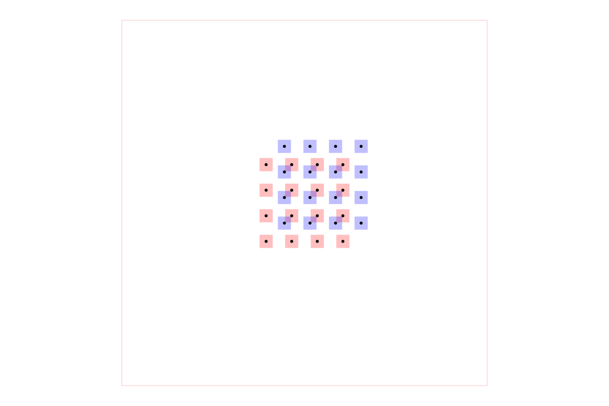

# dataset-srj21

The canonical catalog and deployment wrapper for the ten-circuit tscircuit
“easy topology-pair” dataset. Each synthetic board combines several component
groups and connection topologies to exercise topology merging and multi-
component autorouting. The corpus is pinned from
[`tscircuit/multi-component-dataset-srj01`](https://github.com/tscircuit/multi-component-dataset-srj01),
which remains the source generator used by existing benchmark consumers.

## Example

The image below shows `circuit001`. It is generated by constructing an
`AutoroutingPipelineSolver`, calling `.visualize()`, and converting the
graphics object to SVG with `graphics-debug`.



Regenerate it with `bun run generate:readme-image`.

## Browse and deploy

```sh
bun install
bun run cosmos
bun run build:site
```

The static React Cosmos catalog is exported to `cosmos-export/`, the Vercel
output directory configured by `vercel.json`.
